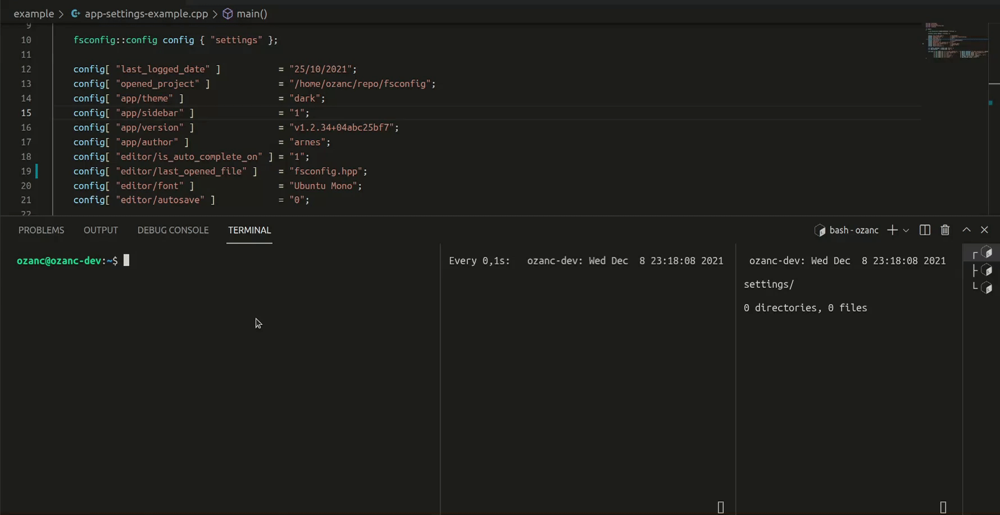

<p align="center">
  
</p>

# fsconfig
Allows a programmer to save/load configurations to/from filesystem in a structured way. Groups are mapped into directories, fields are mapped into file names and values of the fields are mapped into the file contents.

For example, The `config[ "app/version" ] = "v1.0.3+343acd396c";` statement creates `app` directory and creates a file `version` in that directory and writes `v1.0.3+343acd396c` into it.

It is a header only library.

No other dependency than STL.

Provides required files for cmake to be used with `find_package( fsconfig )`

C++17 compliant compiler is needed to make it worked.

Tested only on Linux.

## Example

``` C++
#include <iostream>
#include <filesystem>
#include <fsconfig/fsconfig.hpp>
#include <iomanip>

int main()
{
    ::std::filesystem::create_directory( "settings" );

    fsconfig::config config { "settings" };

    config[ "last_logged_date" ]           = "25/10/2021";
    config[ "opened_project" ]             = "/home/ozanc/repo/fsconfig";
    config[ "app/theme" ]                  = "dark";
    config[ "app/sidebar" ]                = "1";
    config[ "app/version" ]                = "v1.2.34+04abc25bf7";
    config[ "app/author" ]                 = "arnes";
    config[ "editor/is_auto_complete_on" ] = "1";
    config[ "editor/last_opened_file" ]    = "include/fsconfig/fsconfig.hpp";
    config[ "editor/font" ]                = "Ubuntu Mono";
    config[ "editor/autosave" ]            = "0";

    auto editor_settings = config.sub( "editor" );
    auto app_settings    = config.sub( "app" );

    std::cout << std::setw( 25 ) << "is_auto_complete_on : " << editor_settings[ "is_auto_complete_on" ].value() << std::endl
              << std::setw( 25 ) << "last_opened_file : "    << editor_settings.value( "last_opened_file" )      << std::endl
              << std::setw( 25 ) << "font : "                << editor_settings.value( "font" )                  << std::endl
              << std::setw( 25 ) << "font_size : "           << editor_settings.value( "font_size" , "12" )      << std::endl
              << std::setw( 25 ) << "version : "             << config[ "app/version" ].value()                  << std::endl
              << std::setw( 25 ) << "author : "              << app_settings.value( "author" )                   << std::endl;
}
```

```console
   is_auto_complete_on : 1
      last_opened_file : include/fsconfig/fsconfig.hpp
                  font : Ubuntu Mono
             font_size : 12
               version : v1.2.34+04abc25bf7
                author : arnes
```

```console
ozanc@ozanc-dev:~/repo/fsconfig/build/example/single$ tree 
.
└── settings
    ├── app
    │   ├── author
    │   ├── sidebar
    │   ├── theme
    │   └── version
    ├── editor
    │   ├── autosave
    │   ├── font
    │   ├── is_auto_complete_on
    │   └── last_opened_file
    ├── last_logged_date
    └── opened_project

3 directories, 10 files
```

## How to use ?
### Way 1. Install to the system
- Install __fsconfig__ as system-wide.
```bash
cd $(mktemp -d)
git clone https://github.com/OzanCansel/fsconfig.git
cd fsconfig
mkdir build && cd build
cmake ..
sudo cmake --build . --target install -- -j$(nproc)
```


#### Way 1.1.
- Include __fsconfig__ to your cmake project with `find_package( fsconfig )`
``` cmake
cmake_minimum_required( VERSION 3.10 )
project( my_project )

# Allows you to use fsconfig
find_package( fsconfig REQUIRED )

add_executable( my_binary main.cpp )

target_link_libraries( my_binary PRIVATE fsconfig::fsconfig )
```

#### Way 1.2.
- It is not obliged to be included by a cmake project. fsconfig is header only so it will be visible after it is installed to the system. So just include it and make sure that you enabled C++17 standard.

### Way 2. Add as a subdirectory
- Add as an subdirectory to your existing cmake project.

```bash
cd already_existing_project
git clone https://github.com/OzanCansel/fsconfig.git
```
``` cmake
cmake_minimum_required( VERSION 3.10 )
project( already_existing_project )

# Allows you to use fsconfig
add_subdirectory( fsconfig EXCLUDE_FROM_ALL )

add_executable( my_binary main.cpp )

target_link_libraries( my_binary PRIVATE fsconfig::fsconfig )
```

#### Way 3.
Just download `fsconfig.hpp` and include it.

## Contributing
Pull requests are welcome. For major changes, please open an issue first to discuss what you would like to change.

Please make sure to update tests as appropriate.

## Sidenote
I doubt about whether this library will be useful or not, despite it attracts me a lot. The simplicity behind it makes me think that it will provide a nice tool for C++ programmers. It also allows shell programmers to read all of the settings easily because it doesn't require any obscure and complex parsing mechanism. Just traverse directories, look for file names and read their content. So I let it go and see what will happen.

## License
[MIT](https://raw.githubusercontent.com/OzanCansel/fsconfig/master/LICENSE)
